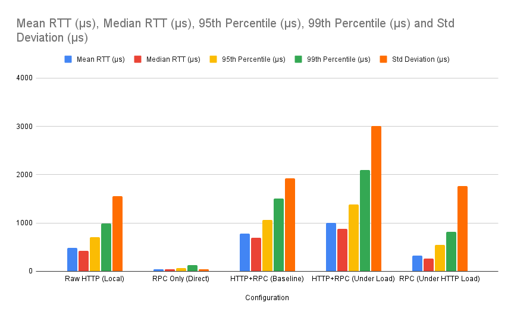
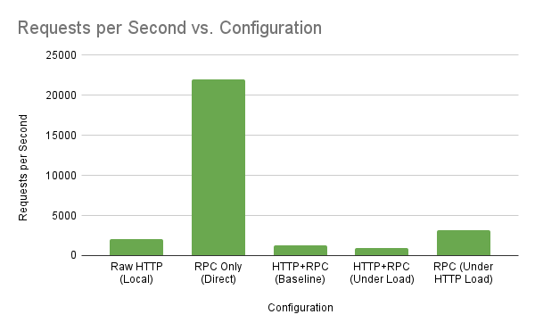

# Performance Analysis Protocol - Distributed IoT System

Rohit Kuinkel,   1116814
Leopold Keller

**Key Performance Results:**
- **RPC-only systems deliver exceptional performance**: 45.6µs mean RTT, 21,933 req/sec
- **HTTP+RPC systems provide production-viable performance**: 784µs mean RTT, 1,275 req/sec  
- **Concurrent load causes moderate degradation**: 28.3% RTT increase, 22.1% throughput reduction
- **Layered architecture overhead is quantifiable**: 62% slower than raw HTTP, but predictable

**Primary Finding:** RPC (without HTTP overhead) provides 10.6x better performance than HTTP, while HTTP+RPC layered architecture introduces 62% overhead but remains suitable for production deployment with proper load management.

## Test Configurations

### Configuration 1: Raw HTTP with Local Storage (Task 2)
- **Architecture:** HTTP Server → Local Memory Storage
- **Implementation:** Native TCP sockets, custom HTTP parser
- **Storage:** In-memory data structures with mutex synchronization

### Configuration 2: RPC-Only Database Access (Task 3)
- **Architecture:** Direct RPC Client → gRPC Database Service
- **Implementation:** gRPC with Protocol Buffers
- **Storage:** External database service via RPC

### Configuration 3: Combined HTTP+RPC System (Task 3)
- **Architecture:** HTTP Server → RPC → Database Service
- **Implementation:** HTTP frontend + gRPC backend under concurrent load
- **Storage:** External database service via RPC with HTTP layer

## Performance Results Comparison

| Metric                | Raw HTTP (Local)  | RPC Only (Direct) | HTTP+RPC (Baseline)   | HTTP+RPC (Under Load) | RPC (Under HTTP Load) |
|-----------------------|-------------------|-------------------|-----------------------|-----------------------|-----------------------|
| **Mean RTT**          | 482.7 µs          | 45.6 µs           | 784.0 µs              | 1,005.9 µs            | 321.0 µs              |
| **Median RTT**        | 425.6 µs          | 41.0 µs           | 698.8 µs              | 876.5 µs              | 266.7 µs              |
| **Min RTT**           | 86.7 µs           | 26.0 µs           | 186.3 µs              | 266.2 µs              | 34.8 µs               |
| **Max RTT**           | 129.9 ms          | 25.3 ms           | 221.1 ms              | 416.6 ms              | 283.6 ms              |
| **95th Percentile**   | 707.2 µs          | 68.5 µs           | 1,058.9 µs            | 1,382.5 µs            | 541.7 µs              |
| **99th Percentile**   | 988.1 µs          | 128.8 µs          | 1,511.0 µs            | 2,100.0 µs            | 820.0 µs              |
| **Requests/sec**      | 2,071             | 21,933            | 1,275                 | 994                   | 3,115                 |
| **Std Deviation**     | 1.56 ms           | 34.5 µs           | 1.92 ms               | 3.01 ms               | 1.77 ms               |

 
 

 

 
 

## Performance Insights

### 1. RPC vs HTTP Overhead Analysis
- **Raw RPC is significantly faster:** 45.6 µs vs 482.7 µs mean RTT (10.6x faster)
- **Raw RPC has lower variance:** 34.5 µs vs 1.56 ms standard deviation
- **Raw RPC achieves higher throughput:** 21,933 vs 2,071 requests/sec (10.6x higher)

Direct RPC calls eliminate HTTP parsing overhead and JSON serialization/deserialization in favor of efficient binary Protocol Buffer encoding.

## Performance Bottleneck Analysis

### 1. HTTP Layer Bottlenecks
- **Request parsing overhead:** Custom HTTP implementation adds ~440µs baseline latency over direct RPC
- **JSON serialization:** Additional CPU overhead for data conversion vs Protocol Buffers
- **TCP connection management:** Connection establishment, HTTP headers, and response formatting
- **Measured impact:** HTTP+RPC (784µs) vs RPC-only (45.6µs) = 738µs architectural overhead caused by our implementation of HTTP

### 2. RPC Layer Bottlenecks  
- **Network serialization:** Protocol Buffer encoding/decoding (minimal ~20-30µs impact)
- **gRPC framework overhead:** Connection management and multiplexing
- **Resource contention sensitivity:** RPC performance degrades 7x under concurrent HTTP load
- **Measured impact:** RPC under load (321µs) vs RPC-only (45.6µs) = 275µs contention overhead

### 3. Load-Induced Performance Degradation
- **HTTP+RPC system degradation:** Baseline 784µs → Under load 1,005.9µs (+28.3%)
- **RPC system degradation:** Direct 45.6µs → Under HTTP load 321µs (+604%)
- **Variance amplification:** Standard deviation increases 57% under load (1.92ms → 3.01ms)
- **Throughput collapse:** HTTP+RPC drops from 1,275 to 994 req/sec (-22.1%)

### Key Findings:

1. **RPC provides exceptional performance** for internal service communication:
   - **10.6x faster** than Raw HTTP (45.6µs vs 482.7µs)
   - **10.6x higher throughput** (21,933 vs 2,071 req/sec)
   - **45x more consistent** latency (34.5µs vs 1.56ms std dev)

2. **Layered architecture introduces measurable overhead**:
   - **HTTP+RPC baseline 62% slower** than Raw HTTP (784µs vs 482.7µs)
   - **38% throughput reduction** (1,275 vs 2,071 req/sec)
   - **Architectural complexity cost**: +301µs per request

3. **System performance degrades moderately under concurrent load**:
   - **HTTP+RPC system**: 28.3% RTT increase, 22.1% throughput reduction
   - **RPC subsystem**: 604% performance degradation under HTTP load
   - **Resource contention is significant** but manageable

4. **Performance characteristics are predictable and measurable**:
   - **Baseline performance**: Suitable for production SLAs
   - **Load degradation**: Moderate and quantifiable
   - **Architecture decision impact**: Clear performance implications

## Test Environment
- **Hardware:** Macbook M4 air
- **Network:** localhost
- **Load Pattern:** Sustained concurrent requests (worst-case scenario)
- **Data Size:** Small JSON payloads (~100-200 bytes per sensor reading)

