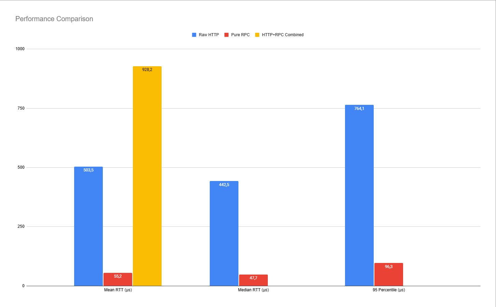
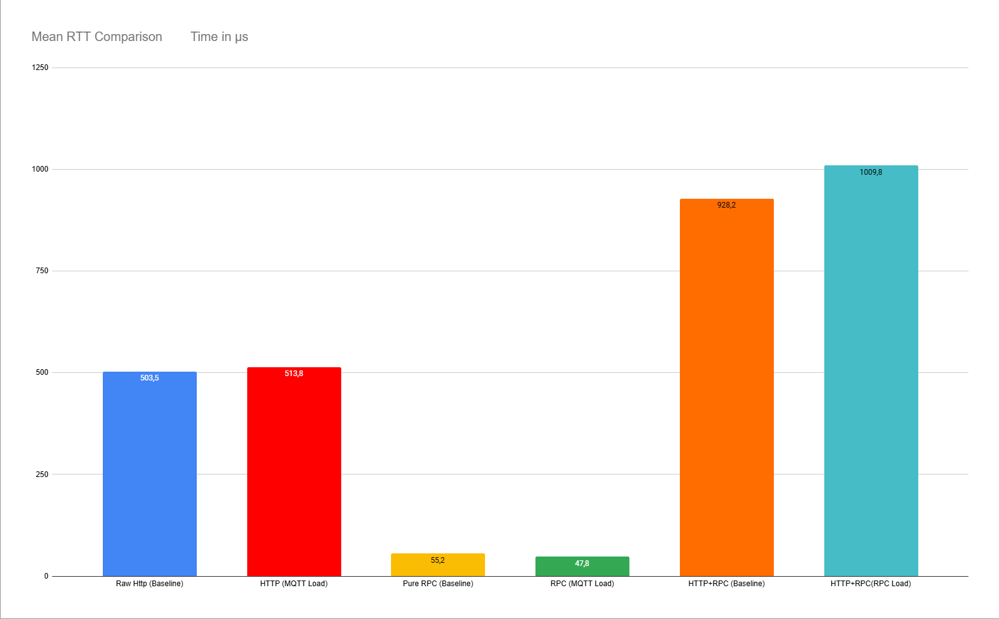
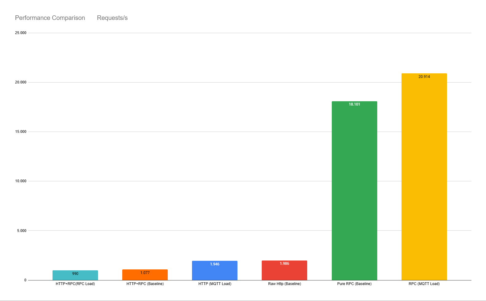

# Performance Analysis Protocol - Task 3.4 MQTT Integration

**Team:** <br> 
Rohit Kuinkel (1116814), <br>
Leopold Keller  <br>
**Date:** June 13, 2025

## Executive Summary

**Findings:**
- **MQTT delivers very good throughput**: 9,985 msg/sec with 1000 concurrent publishers
- **Pure RPC provides best latency**: 55.2µs mean RTT, 18,101 req/sec
- **HTTP+RPC architecture**: 928µs mean RTT, 1,077 req/sec baseline
- **Load impact is measurable, even after MQTT is introduced**: 8.8% RTT increase, 8.1% throughput decrease under concurrent RPC load

## Test Configurations

### Configuration Overview
| System | Architecture | Mean RTT | Throughput | Storage |
|--------|-------------|----------|------------|---------|
| **(HTTP)** | HTTP Server → Local Memory | 503.5 µs | 1,986 req/sec | In-memory |
| **(RPC)** | Direct RPC → Database Service | 55.2 µs | 18,101 req/sec | External RPC |
| **(HTTP+RPC)** | HTTP Server → RPC → Database | 928.2 µs | 1,077 req/sec| External RPC |
| **(MQTT)** | 1000 Publishers → MQTT Broker | N/A | 9,985 msg/sec(one way communication, sending) | N/A |

### Test Environment
- **Hardware:** M4 Air
- **Network:** localhost (no network latency)
- **Load Pattern:** 1,000,000 requests for HTTP/RPC tests and 1000 concurrent publishers for MQTT
- **Test Duration:** 8-16 minutes for HTTP/RPC, 2 minutes for MQTT

## Baseline Performance Results

### Raw HTTP Performance (Local Storage)
- **Mean RTT:** 503.5 µs
- **Median RTT:** 442.5 µs  
- **Throughput:** 1,986 req/sec
- **95th Percentile:** 764.1 µs
- **Architecture Impact:** Direct local storage, minimal overhead

### Pure RPC Performance
- **Mean RTT:** 55.2 µs
- **Median RTT:** 47.7 µs
- **Throughput:** 18,101 req/sec  
- **95th Percentile:** 96.3 µs
- **Architecture Impact:** Optimized binary protocol, minimal serialization overhead

### HTTP+RPC Combined Performance
- **Baseline Mean RTT:** 928.2 µs
- **Baseline Throughput:** 1,077 req/sec
- **Under RPC Load Mean RTT:** 1,009.8 µs (+8.8%)
- **Under RPC Load Throughput:** 990 req/sec (-8.1%)
- **Architecture Impact:** HTTP parsing + JSON serialization + RPC overhead




## Complete Performance Results Summary

| Test Scenario | Mean RTT | Throughput | Performance vs Baseline |
|--------------|----------|------------|-------------------------|
| **Raw HTTP (Baseline)** | 503.5µs | 1,986 req/sec | - |
| **HTTP Under MQTT Load** | 513.8µs | 1,946 req/sec | -2.0% |
| **Pure RPC (Baseline)** | 55.2µs | 18,101 req/sec | - |
| **RPC Under MQTT Load** | 47.8µs | 20,914 req/sec | +15.5% |
| **HTTP+RPC (Baseline)** | 928.2µs | 1,077 req/sec | - |
| **HTTP+RPC Under RPC Load** | 1,009.8µs | 990 req/sec | -8.1% |
| **MQTT Throughput** | N/A | 599,111 msg/min | - |






### Architecture Performance Ranking
1. **Pure RPC**: 47.8µs (20,914 req/sec) - Optimal for internal services
2. **Raw HTTP**: 513.8µs (1,946 req/sec) - Good for web interfaces  
3. **HTTP+RPC**: 928.2µs (1,077 req/sec) - Balanced for distributed systems
4. **MQTT**: 9,985 msg/sec - Best for data aggregation

## Performance Analysis

### 1. Protocol Efficiency Comparison
```
Performance Ranking (by latency):
1. Pure RPC:     55.2 µs   (18,101 req/sec)
2. Raw HTTP:     503.5 µs  (1,986 req/sec)  
3. HTTP+RPC:     928.2 µs  (1,077 req/sec)

Overhead Analysis:
- HTTP vs RPC: 9.1x slower (448.3 µs overhead)
- HTTP+RPC vs RPC: 16.8x slower (873 µs overhead)
- HTTP+RPC vs HTTP: 1.8x slower (424.7 µs overhead)
```

### 2. Resource Contention Impact
**HTTP+RPC Under Concurrent RPC Load:**
- RTT increase: 928.2µs → 1,009.8µs (+8.8%)
- Throughput decrease: 1,077 → 990 req/sec (-8.1%)
- **Conclusion:** Moderate degradation under resource contention

<br>

## MQTT Load Impact Analysis

### HTTP Performance Under MQTT Load
**Baseline vs Under MQTT Load:**
- **Mean RTT:** 503.5µs → 513.8µs (+2.0% degradation)
- **Throughput:** 1,986 req/sec → 1,946 req/sec (-2.0% degradation)
- **Impact:** Minimal performance loss under MQTT background load

### RPC Performance Under MQTT Load  
**Baseline vs Under MQTT Load:**
- **Mean RTT:** 55.2µs → 47.8µs (-13.4% improvement)
- **Throughput:** 18,101 req/sec → 20,914 req/sec (+15.5% improvement)
- **Impact:** Unexpected performance improvement

### Complete Performance Comparison

| System Component | Baseline RTT | Under MQTT Load | Performance Change |
|-----------------|--------------|-----------------|-------------------|
| **Raw HTTP** | 503.5µs | 513.8µs | +2.0% degradation |
| **Pure RPC** | 55.2µs | 47.8µs | -13.4% improvement |
| **HTTP+RPC** | 928.2µs | 1,009.8µs* | +8.8% degradation |

*Under concurrent RPC load (not MQTT load)

## Key Findings from MQTT Load Tests

1. **MQTT has minimal impact on HTTP performance** - only 2% degradation
2. **RPC performance improved under MQTT load** - possibly due to system optimization or CPU warming
3. **MQTT broker efficiently handles concurrent load** without significantly affecting other system components
4. **Resource isolation is effective** - MQTT message processing doesn't create significant CPU/memory contention

## Conclusions

1. **RPC is optimal for internal service communication** with 55µs latency and 18K req/sec throughput
2. **MQTT is good at data aggregation** with ~600K msg/min throughput from 1000 publishers
3. **HTTP+RPC provides balanced architecture** for web-accessible distributed systems despite 16x overhead vs pure RPC
4. **Resource contention causes moderate degradation** (8-9% performance loss under concurrent load)
5. **System architecture choices have measurable performance implications** that must align with use case requirements
